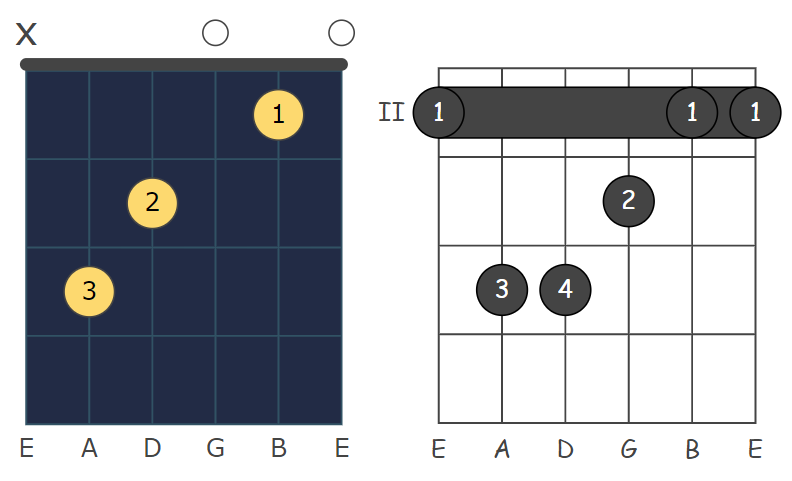

# Chord Diagrammer

A TypeScript library to generate SVG chord diagrams.

Inspired by: https://github.com/tombatossals/react-chords.

Part of [ChordProject](https://chordproject.com/)

## Requirements

- Node.js 20.19.0 or newer.
## Overview

Generates SVG chord diagrams according to received specifications.



## Usage

`Chord Diagrammer` is on npm. To install run:

```sh
$ npm i chordproject-diagrammer
```

It's really easy to draw an SVG chord diagram:

```ts
import { ChordDiagram, Instrument, SvgBuilder } from 'chordproject-diagrammer';

// chord diagram definitions
const chordDiagram = new ChordDiagram({
    frets: [-1, 0, 2, 2, 1, 0],
    fingers: [0, 0, 2, 3, 1, 0],
    baseFret: 1,
});

// instrument definitions
const instrument = new Instrument('Guitar', 6, 4, ['E', 'A', 'D', 'G', 'B', 'E']);

const generator = new SvgBuilder();
const svg = generator.build(chordDiagram, instrument);
document.body.appendChild(svg); // add the svg in the html content (here the body)
```

## Diagram collections

`ChordDiagramCollection` resolves chord definitions supplied by the host application. The
diagrammer does not fetch or own a database; pass a static dataset or another local source:

```ts
import { Chord, ChordDiagramCollection } from 'chordproject-diagrammer';

const collection = new ChordDiagramCollection([
  {
    key: 'C',
    type: 'major',
    bass: '',
    frets: [-1, 3, 2, 0, 1, 0],
    fingers: [0, 3, 2, 0, 1, 0],
    variation: 1,
  },
]);

const diagrams = collection.get(new Chord('C', 'M', ''));
```

The collection normalizes common enharmonic and quality aliases, returns variations ordered by
their `variation` number, and converts definitions into the library's `ChordDiagram` model.

The repository includes a compact guitar dataset with the most accessible position first and
additional playable variations after it. It is generated from
[`tombatossals/chords-db`](https://github.com/tombatossals/chords-db), licensed under MIT; its
license is included at `data/CHORDS_DB_LICENSE`. Project-specific voicings live in
`data/supplemental-guitar.json`, so they survive upstream updates.

To download the current upstream guitar database, regenerate the dataset, and validate collection
and song coverage, run:

```sh
npm run update:guitar-data
```

The generated `data/guitar.json` is the only guitar data published with this package. The source
database is never bundled into the client application.

The collection returns no diagram when the source dataset has no explicit voicing for a chord
variant. The consumer can then choose whether to hide the diagram or fall back to the base chord;
the library does not invent a voicing for an uncovered slash chord.

## Coverage analysis

The HomenaJesus backup can be measured without reading Firebase:

```sh
npm run analyze:song-coverage
```

The command reads the backup's raw ChordPro content and compares valid chord tokens with the
generated guitar dataset. It reports occurrences, unique chords, song coverage, and malformed
tokens separately. For historical coverage analysis only, it expands sequences that users wrote
inside one bracket, such as `[Am-G-F]`, into individual intended chords. This does not make that
syntax valid ChordPro and does not change parser/editor validation.

In the September 2026 HomenaJesus backup it found 8,558 audited chord occurrences, 109 unique
chords, and 100% occurrence and song coverage. `G7/B`, previously uncovered, is supplied in the
project's supplemental definitions.

The same analysis can be run against the ChordProject backup by passing another songs file:

```sh
node scripts/analyze-song-coverage.mjs \
  ../chordproject-client/backups/firestore-chordproject-app-latest/collections/songs.json \
  data/guitar.json
```

The September 2026 ChordProject backup contains 14,636 audited chord occurrences across 158 songs.
It has 98.60% occurrence coverage and 99.37% song coverage. Its remaining gaps are concentrated in
advanced variants and slash chords such as `E7/B`, `D7/C`, `C7sus4/D`, and `Dadd9/F#`, rather than
the common open chords used by the songs.

A ChordDiagram is defined by:

-   **frets** (array of numbers). Use 0 for open strings and -1 for muted strings. Frets must be relative to the base-fret.
-   **fingers** (array of numbers). Use 0 for no finger. The fingers array length must match the frets array length. The fingers are optional
-   **base-fret** (number)

## Customization
You can customize the diagram by changing the default settings.

For example:
```ts
builder.settings.dot.radius = 5; // change the dot radius
builder.settings.neck.lineWidth = 0.8; //change the line width of the neck
```
Here is all the available settings:
- stringSpace
- fretSpace
- fontFamily
- fingering:
  - color
  - margin
  - size
  - visible
- dot:
  - radius
  - borderWith
  - fillColor
  - strokeColor
  - openStringRadius
- neck
  - useRoman
  - color
  - nut:
    - color
    - visible
    - width
  - stringName: 
    - color
    - size
    - margin
    - visible
  - grid:
    - color
    - width
    - visible
  - baseFret:
    - color
    - size
    - margin
    - visible
  - stringInfo:
    - color
    - size
    - margin
    - visible
## Demo

1. Clone
2. Install dependencies:

```sh
$ npm i
```

1.  Run in dev mode:

```sh
$ npm run dev
```

Open a browser and navigate to http://localhost:8082/ to load the demo.

## Contributing

This project welcomes contributions of all types. If you find any bug or want some new features, please feel free to create an issue or submit a pull request.

Join the community and chat with us on **[Discord](https://discord.gg/ZQAgwBC9c8)**

## License
[MIT License](LICENSE)