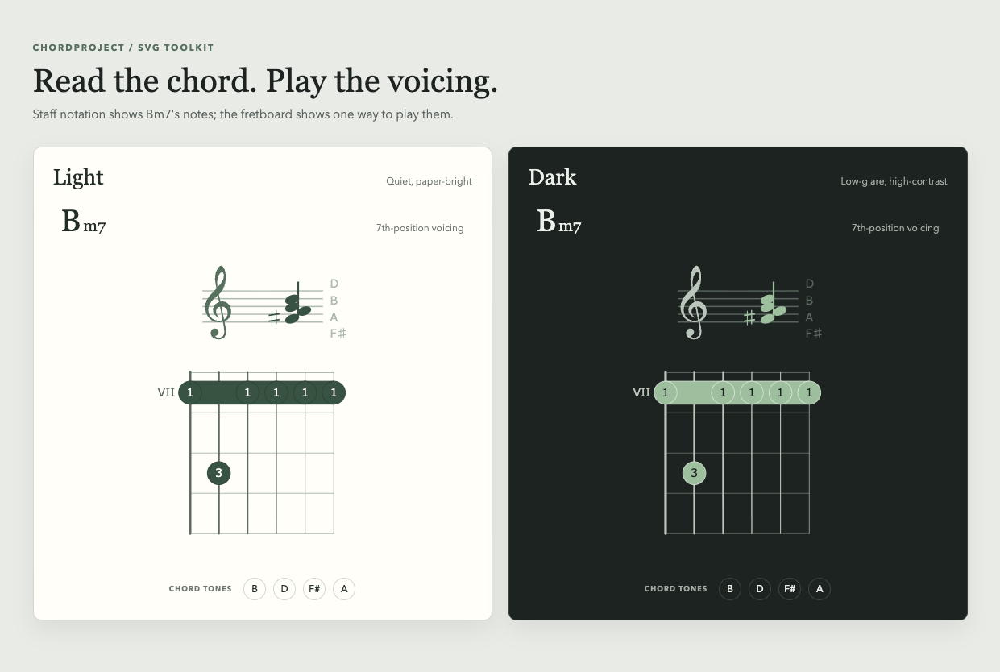

# Chord Diagrammer

A TypeScript library that turns chord voicings into configurable SVG fretboard diagrams and
musical-staff previews. Part of [ChordProject](https://chordproject.com/).



## Install

Node.js 20.19.0 or newer is required for development and builds.

```sh
npm install @chordproject/diagrammer
```

## Render a diagram

`SvgBuilder` creates an SVG element from a `ChordDiagram` and an `Instrument`. Add the returned
element to your UI, or serialize it for use elsewhere.

```ts
import { ChordDiagram, Instrument, SvgBuilder } from '@chordproject/diagrammer';

const diagram = new ChordDiagram({
  frets: [-1, 0, 2, 2, 1, 0], // -1 muted, 0 open, positive values are fretted positions
  fingers: [0, 0, 2, 3, 1, 0],
  baseFret: 1,
});
const guitar = new Instrument('Guitar', 6, 4, ['E', 'A', 'D', 'G', 'B', 'E']);
const builder = new SvgBuilder();

document.querySelector('#diagram')?.replaceChildren(builder.build(diagram, guitar));
```

`ChordDiagram` accepts frets, optional finger numbers, a base fret, and an optional variation
number. Fret values are relative to `baseFret`.

## Chord collections

`ChordDiagramCollection` turns host-provided `DiagramDefinition` records into `ChordDiagram`
instances. It normalizes supported chord aliases, orders matches by variation, and infers a base
fret when one is omitted.

```ts
import { Chord, ChordDiagramCollection } from '@chordproject/diagrammer';

const collection = new ChordDiagramCollection([
  {
    key: 'C',
    type: 'major',
    frets: [-1, 3, 2, 0, 1, 0],
    fingers: [0, 3, 2, 0, 1, 0],
    variation: 1,
  },
]);

const positions = collection.get(new Chord('C', 'M', ''));
```

The package exports `ChordAliases` for consumers that need the same key and chord-quality
normalization. It does not invent voicings: a chord variant without a matching definition returns
an empty array, leaving fallback behavior to the host application.

## Staff previews

`buildStaff()` renders the chord tones on a five-line musical staff. Pass note names when you
already have them; otherwise, the builder derives them from the instrument tuning and voicing.
The staff view makes the pitches clear independently of the guitar fingering, so it can also help
players translate a chord to piano or another instrument.

```ts
const staff = builder.buildStaff(diagram, guitar, ['A', 'C', 'E']);
document.querySelector('#staff')?.replaceChildren(staff);
```

## Appearance and settings

The library returns SVG and does not impose a page background or a light/dark theme. Configure a
builder's `settings` to match the host UI. Each builder owns its settings, so separate builders
can render the same voicing for different themes.

```ts
const darkBuilder = new SvgBuilder();
darkBuilder.settings.neck.strings.color = '#d4d4d4';
darkBuilder.settings.neck.grid.color = '#555b66';
darkBuilder.settings.neck.nut.color = '#d4d4d4';
darkBuilder.settings.neck.stringName.color = '#c4c9d2';
darkBuilder.settings.dot.fillColor = '#414752';
darkBuilder.settings.dot.strokeColor = '#d4d4d4';
darkBuilder.settings.fingering.color = '#ffffff';
```

Available settings are grouped under:

- `stringSpace`, `fretSpace`, `fontFamily`
- `fingering`: `color`, `margin`, `size`, `visible`
- `dot`: `radius`, `borderWidth`, `fillColor`, `strokeColor`, `openStringRadius`
- `neck`: `color`, `useRoman`; `strings.color` and per-string `strings.widths`
- `neck.nut` and `neck.grid`: `color`, `width` (nut), `visible`
- `neck.stringName`, `neck.baseFret`, and `neck.stringInfo`: `color`, `size`, `margin`, `visible`

## Guitar data

The repository includes a guitar voicing dataset exposed as
`@chordproject/diagrammer/data/guitar.json`. It starts with accessible positions and includes
additional variations. The generated data draws from
[`tombatossals/chords-db`](https://github.com/tombatossals/chords-db), licensed under MIT; see
`data/CHORDS_DB_LICENSE`. Project-specific voicings are maintained in
`data/supplemental-guitar.json` and included in dataset generation.

To refresh the upstream data, regenerate the dataset, and run the collection checks:

```sh
npm run update:guitar-data
```

## Demo and tests

```sh
npm install
npm run dev
npm run build
npm run test:collection
```

The demo runs at [http://localhost:8082](http://localhost:8082).

## Publishing

Publishing uses npm Trusted Publishing from GitHub Actions; no npm token is stored in GitHub.
In npm package settings, add a GitHub Actions trusted publisher for organization `chordproject`,
repository `chord-diagrammer`, and workflow file `publish.yml`. After merging a version bump,
push a matching tag such as `v1.1.4`. The workflow verifies the tag against `package.json`, runs
the build and collection tests, then publishes to npmjs.org using OIDC.

## Contributing

Issues and pull requests are welcome. Join the community on
[Discord](https://discord.gg/ZQAgwBC9c8).

## License

[GNU Affero General Public License v3.0](LICENSE)